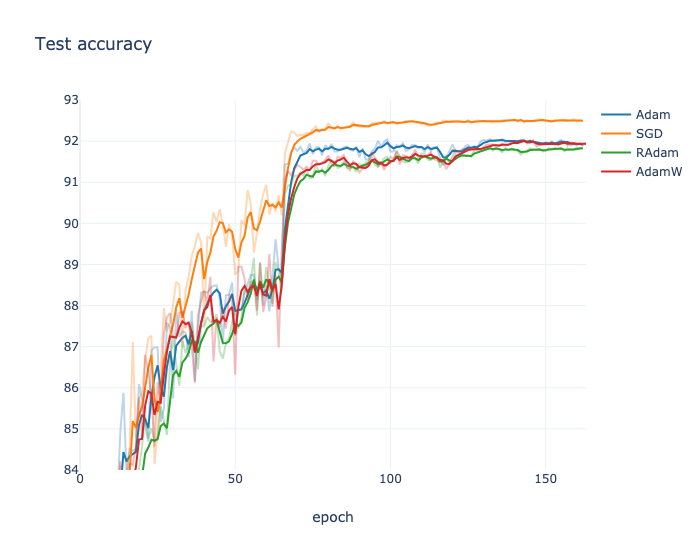
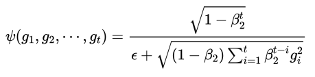
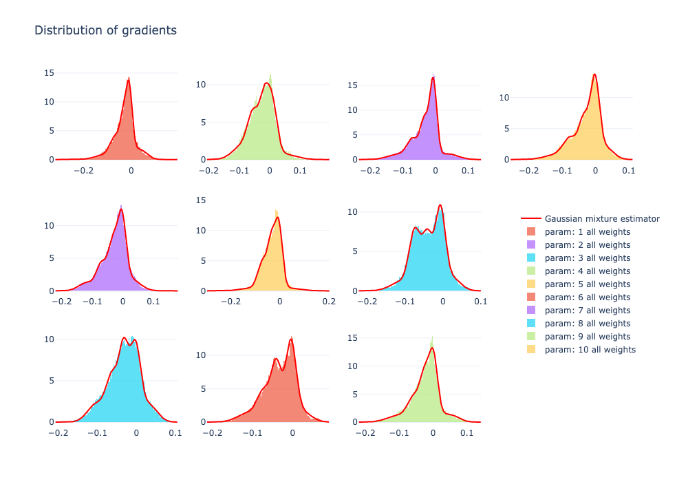
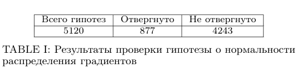
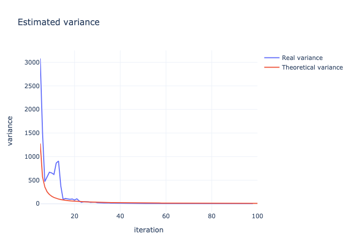
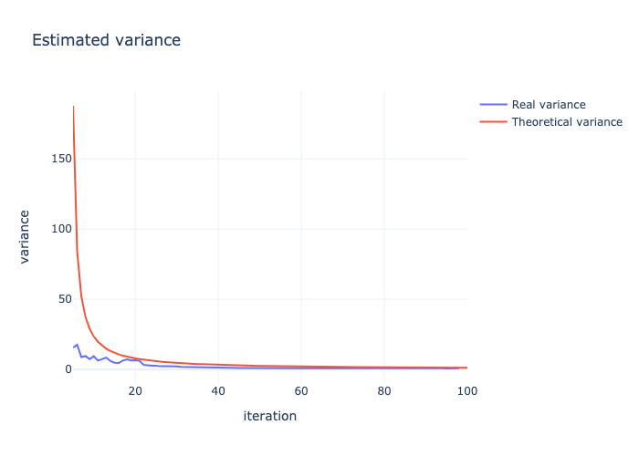

# RAdam_research

В этом репозитории хранится исходный код для запуска и аналитики результатов проекта. 

## Эксперимент

Мы посмотрели на распределение градиентов между последним и предпоследним слоем ResNet-18 на датасете CIFAR-10 c разными оптимизаторами.

 Для каждого веса была проведена бутстрэпная оценка дисперсии на каждой итерации для величины

Так же был применен критерий согласия Шапиро-Уилка и сделана попрака FWER методом Холма. В результате было получено несколько графиков — один для каждого параметра.

## Анализ результатов

Для каждого из десяти нейронов посмотрим на распределение градиентов для всех весов имеющих отношение к ним:

Как видно, в целом, распределение для каждого нейрона похоже на смесь нормальных.

Теперь для каждого веса посмотрим на рапсределение градиентов для него и проверим гипотезу о нормальности. После поправки FWER получим:

Посмотрим на тот для которого гипотеза отверглась (первый график), и на тот, для которого гипотеза не отверглась (второй график). Теоретическую оценку возьмем в предположении нормальности градиентов.

Как видно для первого графика на первых итерациях отклонение достаточно значимо.
